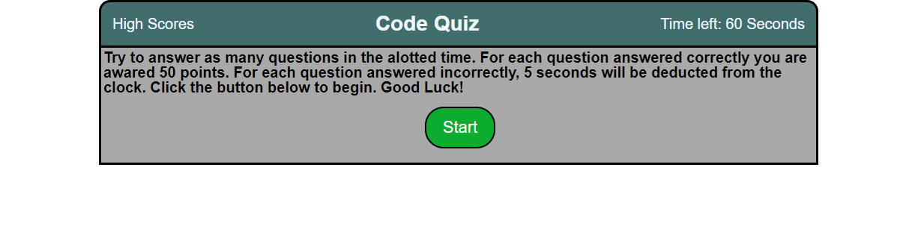

# Javascript Code Quiz

For this project, I created a multiple choice quiz that dynamically generates questions and answers based on user input. The app can determine if a question is answered right or wrong and adjust the score/time accordingly.

## Skills Practiced

- Storing and accessing the local storage.
- Generate elements dynamically based on user input using javascript.
- Designating different scopes in the javascript to only address certain pages of the app.
- CSS positioning and styling, keeping the complexity a limited as possible.
- Create for loops to complete repetative tasks like the logic for if a question is answered right or wrong based on its object attributes.
- Create for loop to generate a high score board in list form for a cleaner presentation of said scores.
- Using event listener to allow the user to submit and store information locally.
- Used the setInterval function to create a timer that starts from user input via event listener.

## Screenshot of Web Page

## Deployment URL

https://peoplesm.github.io/code-quiz/index.html
